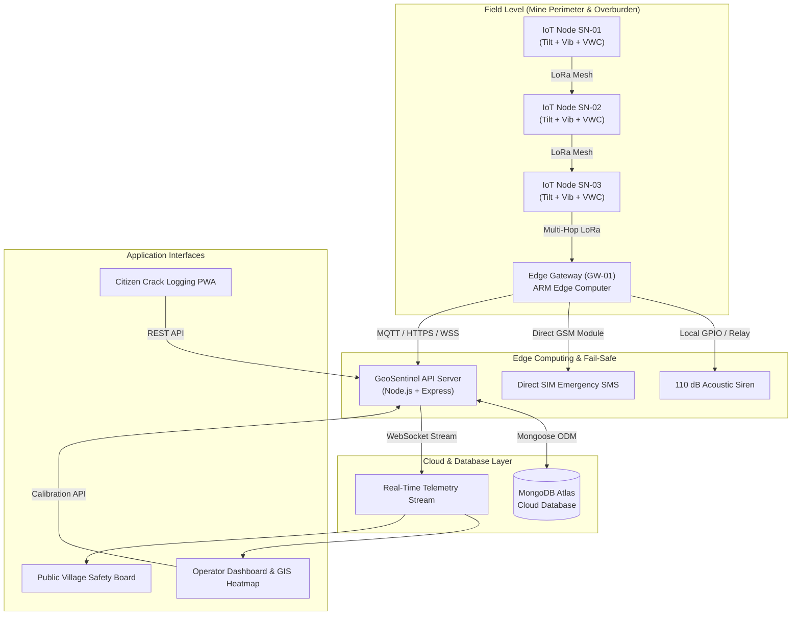

# 🌍 GeoSentinel: Real-Time Mine Subsidence & Geological Early Warning System

<div align="center">


**Autonomous low-cost LoRa surface mesh nodes, edge computing, and real-time GIS analytics for mine slope stability, overburden displacement forecasting, and community disaster resilience.**

[Live Demo](#) • [Architecture](#-system-architecture) • [Quick Start](#-quick-start) • [API Docs](#-api-endpoints--websocket-protocol) • [Physics Model](#-geotechnical-physics-engine)

</div>

---

## 📌 Executive Summary

Underground mining and opencast excavation trigger progressive subsurface void collapse, strata deformation, and critical slope failures. Conventional monitoring techniques (such as satellite InSAR and periodic total station surveys) suffer from high latency (days to weeks), cloud cover obstruction, prohibitive equipment costs, and complete dependency on internet connectivity.

**GeoSentinel** is an end-to-end early warning and geotechnical monitoring system built for the **Ministry of Coal** and the **Directorate General of Mines Safety (DGMS)**:
- **Autonomous Surface LoRa Mesh**: Ultra-low-power edge sensor nodes measuring multi-axis tilt, vibration, and volumetric water content (% VWC) in real time.
- **Fail-Safe Edge Gateway**: Operates 100% offline with solar battery backup, triggering physical acoustic sirens and direct SIM/GSM emergency SMS alerts without internet access.
- **Knothe Time-Dependent Physics Engine**: Real-time Gaussian influence modeling calculating maximum trough subsidence ($S_{max}$), radius of principal influence ($R$), and pore-water shear acceleration.
- **AI-Corroborated Citizen Triage**: Crowdsourced village crack reports with computer vision aperture measurement cross-referenced against subterranean telemetry.
- **Role-Based Terminal & Public Safety Board**: Dedicated operational interfaces for DGMS Administrators, Mine Safety Engineers, and local village populations.

---

## 🚀 Key Features

### 1. 📡 LoRa Multi-Hop Surface Mesh Network
- Dynamic mesh topology routing over 868/915 MHz LoRa.
- Packet hop telemetry tracking RSSI signal strength (-45 dBm to -115 dBm) and packet latency.
- Ultra-low power consumption with solar MPPT charging and automated power conservation modes.

### 2. ⚡ Edge Gateway & Offline Resilience
- Local ARM/Linux edge compute module that aggregates LoRa packets.
- Hardware failover: Automatically fires 110 dB physical acoustic sirens and GSM SMS dispatches if communication with the cloud is severed.
- Real-time sensor health watchdog detecting offline or degraded nodes.

### 3. 🔬 Knothe Subsidence Trough Physics & CIMFR Modeling
- Calculates real-time subsidence profile $S(x) = S_{max} \cdot \exp\left(-\pi \cdot \frac{x^2}{R^2}\right)$.
- Piezometric Pore-Water Multiplier: Dynamically amplifies shear risk when heavy rainfall increases soil moisture saturation.
- Multi-node spatial corroboration matrix eliminating false alarms caused by localized surface anomalies.

### 4. 🗺️ Real-Time GIS Heatmap & 3D Topology Visualization
- Interactive Canvas 2D/WebGL geospatial subsidence heatmap projecting displacement contours and high-risk fault zones.
- Live mesh graph showing active node links, hop counts, battery levels, and node status (`Normal`, `Warning`, `Critical`).

### 5. 📸 Citizen Crack Reporting & Geotechnical Triage
- Crowdsourced mobile reporting interface allowing local villagers to log surface fissures with geo-tagged photos and estimated aperture widths.
- Spatial corroboration engine matching citizen reports with nearby sensor node telemetry.
- Comprehensive triage pipeline (`Pending Review` ➔ `Corroborated & Approved` / `Dismissed`).

### 6. 🛡️ DGMS Security, Threshold Governance & Assembly Shelters
- Per-node calibration for tilt thresholds, vibration limits, and pore-water trigger points.
- Designated emergency assembly zones and shelter capacities with real-time occupancy tracking.
- Cryptographic JWT authentication with bcrypt-hashed credentials stored in MongoDB Atlas.

---

## 🏗️ System Architecture



---

## 📐 Geotechnical Physics Engine

GeoSentinel implements the **Central Institute of Mining and Fuel Research (CIMFR)** and **Knothe Time-Dependent Gaussian Model**:

$$S(x) = S_{max} \cdot \exp\left(-\pi \cdot \frac{x^2}{R^2}\right)$$

Where:
- $S(x)$ = Vertical subsidence at distance $x$ from the extraction boundary (mm).
- $S_{max} = m \cdot a \cdot q$ (Seam thickness $m$, extraction coefficient $a$, and stowing factor $q$).
- $R = H / \tan(\beta)$ = Radius of principal influence, governed by overburden depth $H$ and angle of draw $\beta$.
- **Pore-Water Shear Factor**:
  $$\Psi = 1.0 + 0.5 \cdot \left(\frac{\text{Rainfall Rate (mm/hr)}}{50}\right) \cdot \left(\frac{\text{VWC (\%)}}{100}\right)$$

Alert levels escalate automatically when two or more adjacent nodes exceed the critical shear failure envelope simultaneously.

---

## 📂 Project Structure

```
Geosentinel/
├── backend/                        # Node.js Express REST & WebSocket Server
│   ├── config/                     # Database connection & Atlas configuration
│   ├── middleware/                 # JWT Authentication & API Key validators
│   ├── models/                     # Mongoose Schemas (User, Node, Alert, Report, Gateway)
│   ├── routes/                     # Express API Route Handlers
│   ├── simulator/                  # CSV replay and IoT packet simulators
│   ├── .env                        # Environment configuration
│   ├── server.js                   # Main server entrypoint (HTTP + WebSocket)
│   ├── seed.js                     # Atlas database seeding script
│   └── test-api.js                 # Automated API test suite
├── src/                            # Frontend React 19 + TypeScript + Vite Application
│   ├── components/
│   │   ├── admin/                  # DGMS Settings & Threshold Calibration
│   │   ├── auth/                   # Staff/Admin Login Modal
│   │   ├── citizen/                # Citizen Crack Reporting & Triage Modals
│   │   ├── gateway/                # Edge Gateway details & siren controls
│   │   ├── gis/                    # Canvas 2D / WebGL GIS Heatmap
│   │   ├── icons/                  # Optimized Lucide Icon package
│   │   ├── landing/                # Drizzle-style Landing Page & Partner Strip
│   │   ├── operator/               # Chief Operator Terminal & Telemetry Grids
│   │   ├── public/                 # Village Safety Board (Multi-lingual)
│   │   └── topology/               # Mesh Network Topology Graph
│   ├── context/                    # GeoSentinel Global State & WebSocket Provider
│   ├── services/                   # Audio Siren Synthesizer & Physics Engine
│   ├── types/                      # TypeScript data structures & telemetry schemas
│   ├── App.tsx                     # Top-level application router
│   ├── index.css                   # Tailwind v4 custom styles & animations
│   └── main.tsx                    # React DOM entry point
├── dist/                           # Production optimized build bundle
├── package.json                    # Frontend package dependencies & scripts
├── vite.config.ts                  # Vite configuration & proxy rules
└── README.md                       # Complete project documentation
```

---

## 💻 Tech Stack

| Domain | Technology | Description |
|---|---|---|
| **Frontend Framework** | React 19 + TypeScript | High-performance reactive UI with strict typing |
| **Build Tooling** | Vite 8 + TailwindCSS v4 | Instant HMR and optimized production bundling |
| **Backend Server** | Node.js + Express | High-throughput REST API with CORS and JSON web tokens |
| **Real-Time Stream** | WebSockets (`ws`) | Bidirectional sub-second sensor telemetry push |
| **Database** | MongoDB Atlas + Mongoose | Cloud NoSQL cluster for nodes, alerts, reports, and users |
| **Security & Auth** | bcryptjs + jsonwebtoken | Salted password hashing and signed bearer token authorization |
| **GIS & Visualization**| HTML5 Canvas / WebGL | Hardware-accelerated geospatial heatmaps and topology graphs |
| **Audio Alerting** | Web Audio API | Client-side acoustic disaster alarm synthesizer |

---

## ⚡ Quick Start

### Prerequisites
- **Node.js**: v18.0.0 or higher
- **npm**: v9.0.0 or higher
- **MongoDB Atlas** account (or local MongoDB URI)

### 1. Clone the Repository
```bash
git clone https://github.com/yashsinghal1234/Geosentinel.git
cd Geosentinel
```

### 2. Install Dependencies
```bash
# Install frontend dependencies
npm install

# Install backend dependencies
cd backend
npm install
cd ..
```

### 3. Configure Environment Variables
Create or verify `backend/.env`:
```env
PORT=8000
MONGODB_URI=mongodb+srv://<username>:<password>@cluster1.mongodb.net/geosentinel?retryWrites=true&w=majority
JWT_SECRET=geosentinel_sih_2026_coal_mine_secret_key_884920482
NODE_ENV=development
```

### 4. Seed Database
Seed standard mine sectors, sensor nodes, emergency assembly shelters, and verified credentials:
```bash
node backend/seed.js
```

### 5. Start Development Servers
In two separate terminal windows:

**Terminal 1 (Backend Server):**
```bash
node backend/server.js
# Backend listening on http://localhost:8000
```

**Terminal 2 (Frontend Client):**
```bash
npm run dev
# Vite dev server running at http://localhost:5173
```

---

## 🔐 Role-Based Access Control (RBAC)

GeoSentinel enforces strict multi-tier permissions:
- 👑 **DGMS Administrator (L4)**: Full system configuration, per-node threshold calibration, assembly zone editing, and user governance.
- 🛡️ **Chief Operator (L3)**: Real-time sensor telemetry monitoring, manual siren dispatch, and citizen report triage.
- 👥 **Public Citizen**: Unlocked access to the Live Village Safety Board, multi-lingual audio warnings, and crowdsourced fissure reporting.

> **Security Note:** All credentials and authentication tokens are cryptographically hashed using salted bcrypt and managed securely via environment configuration and MongoDB Atlas.

---

## 🌐 API Endpoints & WebSocket Protocol

### Authentication
- `POST /api/auth/login`: Authenticate with email & password; returns signed JWT and user profile.
- `GET /api/auth/me`: Retrieve currently authenticated user context.

### Sensor Nodes & Telemetry
- `GET /api/nodes`: List all IoT surface mesh nodes with live readings and operational status.
- `GET /api/nodes/:id`: Get detailed telemetry history and thresholds for a specific node.
- `POST /api/nodes/reading`: Push a new IoT telemetry packet (LoRa Gateway bridge).
- `PATCH /api/nodes/:id/thresholds`: Update node alert thresholds (Admin only).

### Edge Gateway
- `GET /api/gateway/status`: Get edge gateway connection status, battery, and siren state.
- `POST /api/gateway/siren`: Trigger or silence physical edge sirens.

### Citizen Crack Logs
- `GET /api/reports`: List all crowdsourced crack logs with filter options (`all`, `pending`, `approved`, `dismissed`).
- `POST /api/reports`: Submit a new geo-tagged crack report with photo URL and aperture width.
- `PATCH /api/reports/:id/status`: Update report review status (`Corroborated & Approved` / `Dismissed`).

### Emergency Alerts
- `GET /api/alerts`: List historical emergency broadcasts and SMS dispatch records.
- `POST /api/alerts/broadcast`: Trigger a manual emergency alert broadcast.

### WebSocket Real-Time Stream
- **URL**: `ws://localhost:8000`
- **Events Broadcasted**:
  - `INITIAL_DATA`: Initial snapshot of all nodes, gateway status, alerts, and crack logs.
  - `NODE_UPDATE`: Real-time telemetry tick (tilt, vibration, moisture, battery).
  - `ALERT_TRIGGERED`: Instant critical alert broadcast.
  - `SIREN_STATE`: Edge siren toggle notification.

---

## 🧪 Automated Testing

Run the automated backend test suite (validates authentication, JWT rejection, telemetry push, and report creation):
```bash
npm run test:backend
```

---

## 🚀 Production Build

To compile a production-ready bundle:
```bash
npm run build
```
The compiled static assets will be located in the `dist/` directory, ready to deploy to **Vercel**, **Netlify**, or **AWS S3/CloudFront**.

---

## 📜 Problem Statement Context (SIH 2026)

- **Problem Statement ID**: 25
- **Organization**: Ministry of Coal, Government of India
- **Category**: Hardware & Software Hybrid / Disaster Management
- **Target Deployment**: Jharia, Raniganj, Singrauli, and Korba Coalfields

---

## 📄 License

This project is licensed under the ISC License. Developed for the Smart India Hackathon (SIH 2026).
