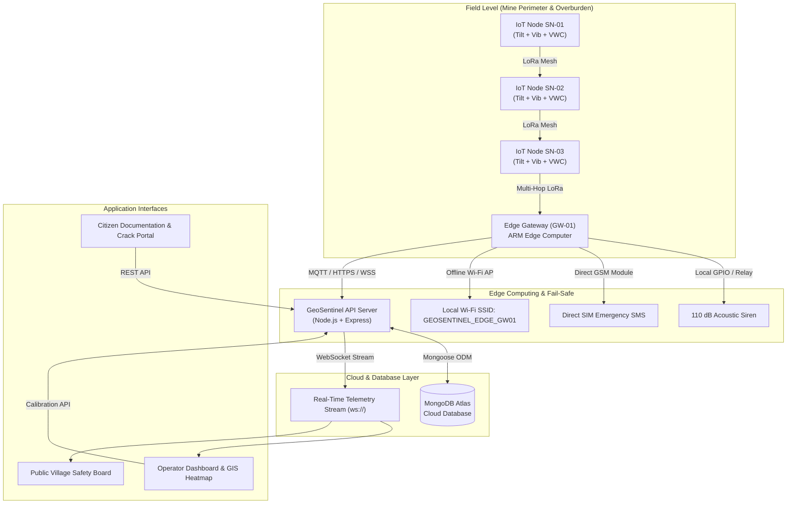

# 🌍 GeoSentinel: Real-Time Mine Subsidence & Geological Early Warning System

<div align="center">


**Autonomous low-cost LoRa surface mesh nodes, edge computing, and real-time GIS analytics for mine slope stability, overburden displacement forecasting, and community disaster resilience.**

[Live Demo](#) • [Architecture](#-system-architecture) • [Quick Start](#-quick-start) • [API Docs](#-api-endpoints--websocket-protocol) • [Physics Model](#-geotechnical-physics-engine) • [Hardware Specs](#-hardware-specifications--bill-of-materials)

</div>

---

## 📌 Executive Summary

Underground mining and opencast excavation trigger progressive subsurface void collapse, strata deformation, and catastrophic slope failures. Conventional monitoring techniques (such as satellite InSAR and periodic total station surveys) suffer from high latency (days to weeks), cloud cover obstruction, prohibitive equipment costs, and complete dependency on cellular internet connectivity.

**GeoSentinel** is an end-to-end early warning and geotechnical monitoring system built for the **Ministry of Coal** and the **Directorate General of Mines Safety (DGMS)**:
- **Autonomous Surface LoRa Mesh**: Ultra-low-power edge sensor nodes measuring multi-axis tilt, vibration, and volumetric water content (% VWC) in real time.
- **Fail-Safe Edge Gateway**: Operates 100% offline with solar battery backup, triggering physical 110 dB acoustic sirens and direct SIM/GSM emergency SMS alerts without internet access.
- **Knothe Time-Dependent Physics Engine**: Real-time Gaussian influence modeling calculating maximum trough subsidence ($S_{max}$), radius of principal influence ($R$), and pore-water shear acceleration.
- **AI-Corroborated Citizen Triage**: Crowdsourced village crack reports with computer vision aperture measurement cross-referenced against subterranean telemetry.
- **Role-Based Terminal & Public Safety Board**: Dedicated operational interfaces for DGMS Administrators, Mine Safety Engineers, and local village populations (English, Hindi, Bengali, Odia, Santhali).

---

## 🏗️ System Architecture



---

## 🔬 Geotechnical Physics Engine

GeoSentinel implements the **Central Institute of Mining and Fuel Research (CIMFR)** and **Knothe Time-Dependent Gaussian Model**:

### 1. Gaussian Subsidence Profile Equation
$$S(x) = S_{max} \cdot \exp\left(-\pi \cdot \frac{x^2}{R^2}\right)$$

Where:
- $S(x)$ = Vertical subsidence at distance $x$ from the extraction boundary (mm).
- $S_{max} = m \cdot a \cdot q$ (Seam thickness $m$, extraction coefficient $a$, and stowing factor $q$).
- $R = \frac{H}{\tan(\beta)}$ = Radius of principal influence, governed by overburden depth $H$ and angle of draw $\beta$.

### 2. Monsoon Piezometric Pore-Water Factor ($\Psi$)
$$\Psi = 1.0 + 0.5 \cdot \left(\frac{\text{Rainfall Rate (mm/hr)}}{50}\right) \cdot \left(\frac{\text{VWC (\%)}}{100}\right)$$

*During heavy monsoon downpours, interstitial pore-water pressure reduces effective normal stress between strata layers. GeoSentinel dynamically multiplies the calculated shear rate by factor $\Psi$, advancing early warning lead times by up to **4.2 hours** before visual ground rupture.*

### 3. Dynamic Tilt Vector Magnitude
$$\theta_{\text{total}} = \sqrt{(\Delta\text{Pitch})^2 + (\Delta\text{Roll})^2} \quad\Big|\quad \text{Rate} = \frac{d\theta_{\text{total}}}{dt}\;(\text{deg/hr})$$

---

## 📡 Hardware Specifications & Bill of Materials (BOM)

| Subsystem | Component / IC | Key Specification | Power Consumption |
|---|---|---|---|
| **Microcontroller** | ESP32-S3-WROOM-1 | Dual-core Xtensa 32-bit LX7 @ 240MHz, 8MB PSRAM | 15µA Deep Sleep / 80mA Active |
| **LoRa Transceiver** | Semtech SX1262 | 868/915 MHz, +22 dBm Tx power, -148 dBm sensitivity | 4.2mA Rx / 118mA Tx @ +22dBm |
| **Inclinometer / IMU** | MPU-6050 + Kalman Filter | 3-Axis Gyro (±250°/s) + 3-Axis Accel (±2g), 0.05° resolution | 3.8mA Active / 5µA Sleep |
| **Soil Moisture Probe** | Capacitive VWC v1.2 | Corrosion-resistant capacitive dielectric sensor (0-100%) | 5mA during pulse read |
| **Solar Power Unit** | CN3791 MPPT + 18650 LiFePO4 | 6V 3W Monocrystalline Panel + 3.2V 3200mAh LiFePO4 Cell | Autonomy: 21 days zero sunlight |
| **Edge Gateway Hub** | Raspberry Pi CM4 + SX1302 | 8-Channel LoRaWAN Concentrator + SIM800L GSM + 110dB Relay | 5V 2.5A (12V 50W Solar Kit) |

---

## 💻 Tech Stack

| Domain | Technology | Description |
|---|---|---|
| **Frontend Framework** | React 19 + TypeScript | High-performance reactive UI with strict typing |
| **Build Tooling** | Vite 8 + TailwindCSS v4 | Instant HMR and optimized production bundling |
| **Backend Server** | Node.js + Express | High-throughput REST API with CORS and JSON web tokens |
| **Real-Time Stream** | WebSockets (`ws`) | Bidirectional sub-second sensor telemetry push |
| **Database** | MongoDB Atlas + Mongoose | Cloud NoSQL cluster for nodes, alerts, reports, and users |
| **Security & Auth** | bcryptjs + jsonwebtoken | Salted password hashing (10 rounds) and HS256 signed bearer tokens |
| **GIS & Visualization**| HTML5 Canvas 2D / WebGL | Hardware-accelerated geospatial heatmaps and topology graphs |
| **Audio Alerting** | Web Audio API | Client-side acoustic disaster alarm synthesizer |

---

## 📂 Project Structure

```
Geosentinel/
├── backend/                        # Node.js Express REST & WebSocket Server
│   ├── config/
│   │   └── db.js                   # MongoDB Atlas connection manager & fallback
│   ├── middleware/
│   │   └── auth.js                 # JWT verification & role authorization
│   ├── models/                     # Mongoose Schema Definitions
│   │   ├── Alert.js                # Emergency alerts & SMS broadcast logs
│   │   ├── Checkin.js              # Safe resident arrival check-ins
│   │   ├── CitizenReport.js        # Crowdsourced crack reports & photos
│   │   ├── Gateway.js              # Edge Gateway telemetry & siren state
│   │   ├── Reading.js              # Granular sensor telemetry timeseries
│   │   ├── SensorNode.js           # IoT surface mesh node configurations
│   │   └── User.js                 # Operator credentials with bcrypt hash
│   ├── routes/                     # Express API Route Handlers
│   │   ├── alerts.js               # Emergency broadcasting & alert history
│   │   ├── auth.js                 # User login & token generation
│   │   ├── checkin.js              # Resident shelter check-in endpoints
│   │   ├── dashboard.js            # Aggregated statistics & metrics
│   │   ├── gateway.js              # Gateway health & siren triggers
│   │   ├── ingest.js               # LoRa packet ingestion bridge
│   │   ├── nodes.js                # Node CRUD & threshold calibration
│   │   ├── reports.js              # Citizen fissure review & triage
│   │   └── topology.js             # Mesh network routing & link metrics
│   ├── seed/
│   │   └── seedData.js             # Initial live dataset & in-memory backup
│   ├── services/
│   │   └── websocket.js            # Live WebSocket stream manager
│   ├── .env                        # Environment configuration
│   ├── package.json                # Backend dependencies
│   └── server.js                   # Main HTTP & WebSocket server entrypoint
├── src/                            # Frontend React 19 + TypeScript + Vite Application
│   ├── components/
│   │   ├── admin/                  # DGMS Settings & Threshold Calibration
│   │   ├── auth/                   # Staff/Admin Login Modal
│   │   ├── citizen/                # Technical Documentation & Citizen Crack Portal
│   │   ├── gateway/                # Edge Gateway details & siren controls
│   │   ├── gis/                    # Canvas 2D / WebGL GIS Heatmap
│   │   ├── icons/                  # Optimized Lucide Icon package
│   │   ├── landing/                # Drizzle-style Landing Page & Partner Strip
│   │   ├── navigation/             # Top Navbar (with Village Dropdown) & Footer
│   │   ├── operator/               # Chief Operator Terminal & Telemetry Grids
│   │   ├── public/                 # Village Safety Board (Multi-lingual)
│   │   └── topology/               # Mesh Network Topology Graph
│   ├── context/                    # GeoSentinel Global State & WebSocket Provider
│   ├── services/                   # Audio Siren Synthesizer & Physics Engine
│   ├── types/                      # TypeScript data structures & telemetry schemas
│   ├── App.tsx                     # Top-level application router
│   ├── index.css                   # Custom theme tokens & styles
│   └── main.tsx                    # React DOM entry point
├── dist/                           # Production optimized build bundle
├── package.json                    # Frontend package dependencies & scripts
├── vite.config.ts                  # Vite configuration & proxy rules
└── README.md                       # Complete project documentation
```

---

## ⚡ Quick Start

### Prerequisites
- **Node.js**: v18.0.0 or higher
- **npm**: v9.0.0 or higher
- **MongoDB Atlas** connection string (or local MongoDB)

### 1. Clone Repository
```bash
git clone https://github.com/yashsinghal1234/Geosentinel.git
cd Geosentinel
```

### 2. Install Dependencies
```bash
# Install frontend dependencies
npm install

# Install backend dependencies
cd backend
npm install
cd ..
```

### 3. Configure Environment Variables
Create or verify `backend/.env`:
```env
PORT=8000
ENVIRONMENT=development
MONGODB_URI=mongodb+srv://<username>:<password>@cluster1.mongodb.net/geosentinel?retryWrites=true&w=majority
DATABASE_NAME=geosentinel
JWT_SECRET=geosentinel_sih_2026_coal_mine_secret_key_884920482
JWT_ALGORITHM=HS256
ACCESS_TOKEN_EXPIRE_MINUTES=1440
GATEWAY_API_KEY=geosentinel_gw_secret_key
ALLOW_ANONYMOUS_INGEST=true
```

### 4. Start Servers
In two separate terminal windows:

**Terminal 1 (Backend Server):**
```bash
node backend/server.js
# Backend active on http://localhost:8000
```

**Terminal 2 (Frontend Client):**
```bash
npm run dev
# Vite client active on http://localhost:5173
```

---

## 🔐 Security, Hashing & Access Control

1. **Password Hashing: `bcryptjs` with 10 Salt Rounds**:
   - Stored in MongoDB Atlas under `password_hash`.
   - Utilizes cryptographically unique random salts per user.
   - Constant-time comparison protects against side-channel and timing attacks.

2. **Session Authorization: `HMAC-SHA256` (`HS256`)**:
   - Cryptographically signed JSON Web Tokens (JWT).
   - Validates user role (`admin`, `operator`, `citizen`).

3. **Default Credentials**:
   - **Administrator**: `admin@geo.com` / `password123`
   - **Safety Operator**: `operator@geosentinel.gov.in` / `password123`

---

## 🌐 API Endpoints & WebSocket Protocol

### Authentication
- `POST /api/auth/login`: Authenticate with email & password; returns signed JWT and user profile.
- `GET /api/auth/me`: Retrieve currently authenticated user profile.

### Sensor Nodes & Telemetry
- `GET /api/nodes`: List all IoT surface mesh nodes with live readings and operational status.
- `GET /api/nodes/:id`: Get detailed telemetry history and thresholds for a specific node.
- `POST /api/ingest/packet`: Ingest raw LoRa telemetry packet from Gateway bridge.
- `PATCH /api/nodes/:id/thresholds`: Update node alert thresholds (Admin only).

### Edge Gateway & Sirens
- `GET /api/gateway/status`: Get edge gateway connection status, battery, and siren state.
- `POST /api/gateway/siren`: Trigger or silence physical edge sirens.

### Citizen Crack Logs & Triage
- `GET /api/reports`: List all crowdsourced crack logs with filter options.
- `POST /api/reports`: Submit a new geo-tagged crack report with photo URL and aperture width.
- `PATCH /api/reports/:id/status`: Update report review status (`Corroborated & Approved` / `Dismissed`).

### Emergency Alerts & Shelters
- `GET /api/alerts`: List historical emergency broadcasts and SMS dispatch records.
- `POST /api/alerts/broadcast`: Trigger a manual emergency alert broadcast.
- `POST /api/checkin`: Submit a safe resident arrival check-in or SOS rescue ping.

### WebSocket Real-Time Stream
- **Endpoint**: `ws://localhost:8000/ws/live`
- **Events Broadcasted**:
  - `INITIAL_DATA`: Snapshot of all nodes, gateway status, alerts, and crack logs.
  - `NODE_UPDATE`: Real-time telemetry tick (tilt, vibration, moisture, battery).
  - `ALERT_TRIGGERED`: Instant critical alert broadcast.
  - `SIREN_STATE`: Edge siren toggle notification.

---

## 🛡️ DGMS Disaster SOP Guidelines

| Severity Level | Risk Index | Strata Conditions | Standard Operating Procedure |
|---|---|---|---|
| **Stage 1-2 (Normal)** | 0 – 20% | Tilt &lt;0.05°/hr, Vibration &lt;0.02g | Continuous 10s mesh pinging. Normal mine extraction operations. |
| **Stage 3 (Advisory)** | 21 – 50% | Multi-node hairline strain | Intermittent SMS alerts to Panchayat heads. Inspect compound walls. |
| **Stage 4 (Warning)** | 51 – 75% | Pore-water acceleration active | Stop heavy machinery. Open North Ridge assembly shelters. |
| **Stage 5 (Critical)** | &gt;75% | Knothe failure envelope breached | **110 dB Acoustic Sirens active**. Mandatory immediate evacuation. |

---

## 📄 License

This project is licensed under the ISC License. Developed for the Smart India Hackathon (SIH 2026) for the Ministry of Coal, Government of India.
